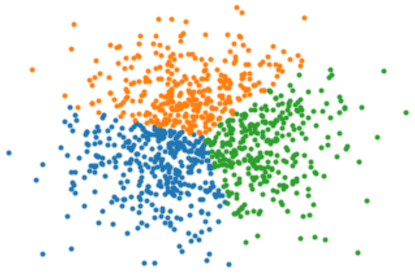

pytorch implementation of basic kmeans algorithm(lloyd method with forgy initialization) with gpu support

usage:
```python
from kmeans_pytorch.kmeans import lloyd
import numpy as np 

A = np.concatenate([np.random.randn(1000, 2), p.random.randn(1000, 2)+3, p.random.randn(1000, 2)+6], axis=0)

#lloyd(X, n_clusters, device=0, tol=1e-4)
clusters_index, centers = lloyd(A, 2, device=0, tol=1e-4)
```

See kmeans_test.ipynb for some test examples


